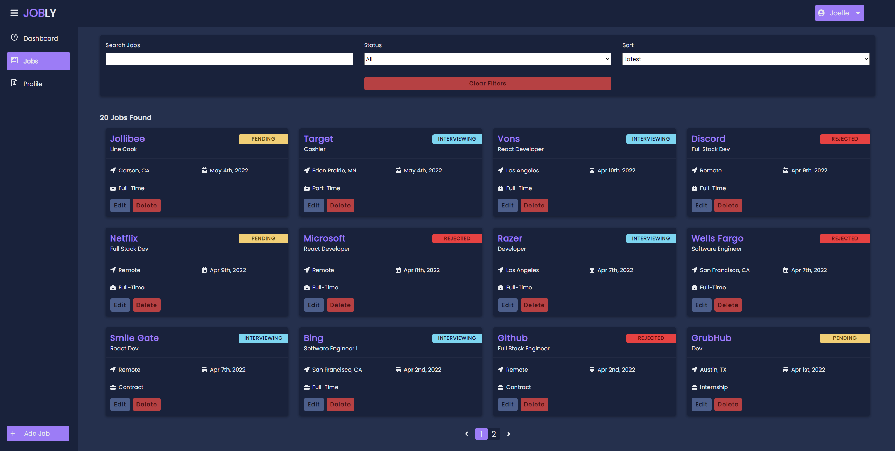

# Jobly

Jobly is a tool created as a personal project to keep track of job applications. 

# Features
* Dashboard homepage for viewing applications stats and monthly chart created with Recharts
* REST API for CRUD with sorting, filtering, and pagination

